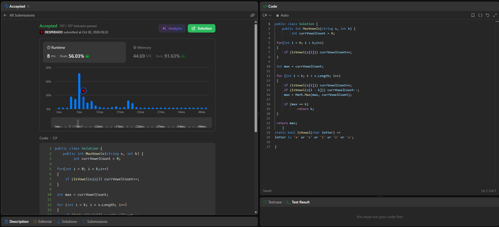

# LeetCode 1456 - Maximum Number of Vowels in a Substring of Given Length

- [Account details](account.md)
- [Problem](https://leetcode.com/problems/maximum-number-of-vowels-in-a-substring-of-given-length/)
- [C# solution](1456_MaxVowelsInSubstring/Solution.cs)
- [Accepted submission link](1456_MaxVowelsInSubstring/leetcode.md)

The solution counts the vowels in the first window of length `k`, then updates
the count using the entering and leaving characters as the window moves.
Time complexity: `O(n)`. Extra space: `O(1)`.

